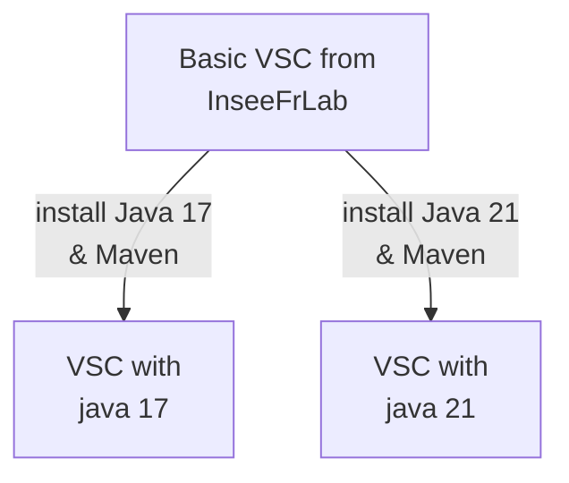

Welcome ! You can use my vscode docker image to work on your Java apps !

# onyxia-datascience-images

This docker image is a custom docker images made to use in Onyxia for the [ENSAI](https://ensai.fr/) TD. Simply fill the custom image name to either `odysseu/onyxia-vscode-java:j21` or `odysseu/onyxia-vscode-java:j17` to have respectively java 21 or java 17 pre installed with your VSCode.

## Link for docker images

Find the image tags for your docker cli on [Dockerhub : vscode Images with python and java](https://hub.docker.com/r/odysseu/onyxia-vscode-java/tags)

## scheme for what's building

