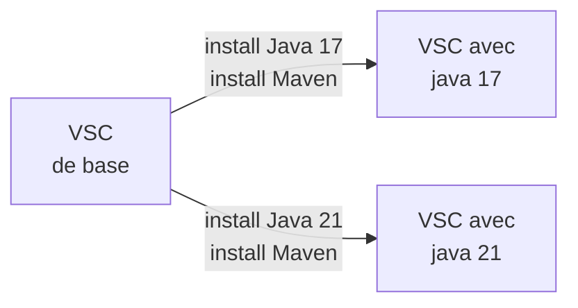

# onyxia-datascience-images

Custom docker images to use in Onyxia

## Link for docker images

[Dockerhub > vscode Images with python and java](https://hub.docker.com/r/odysseu/onyxia-vscode-java/tags)

## scheme for what's building

