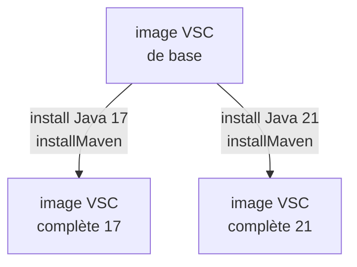

# onyxia-datascience-images

Custom docker images to use in Onyxia

## Link for docker image
- [vscode with python and java](https://hub.docker.com/r/odysseu/onyxia-vscode-java/tags)

## 

```mermaid
flowchart TD
A[image VSC \nde base]
B[image VSC \ncomplète 17]
C[image VSC \ncomplète 21]
A -->|install Java 17\n installMaven| B
A -->|install Java 21\n installMaven| C
```